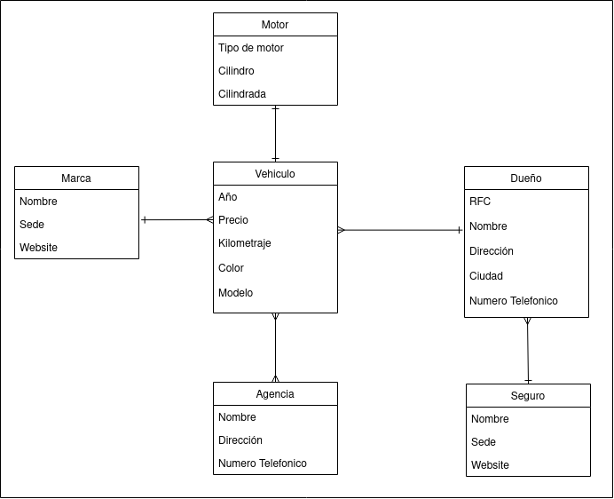

# API-REPUVE

## Description
This project is about a public vehicle registration in wich we are able to:
  + **Register a vehicle.**
  + **Search a vehicle.**
  + **See list of registered vehicles.**
  + **Update vehicle information.**
  + **Deregister a vehicle**

## Technologies
For this project we are going to use the next technologies:
  + JAVA 11
  + HIBERNATE
  + JPA
  + MAVEN
  + MySQLServer 8.0.30

## Workflow
This section is going to be in spanish, because our team speak spanish, and this is going to be the structure of what we are going to do and how we are going to do it.

Este proyecto se dividira por faces de desarrollo para facilitar un desarrollo agil, para el seguimiento de este proyecto se usara la metodología Kanban, en la cual a cada miembro de equipo se le asignan tareas de acuerdo a una entidad de nuestra tabla entidad relación.

## Primero Gateamos
Creación de Entidades
Creación de DTOs
Creación del Servicio
Creación del Controlador
Testing de los servicios implementados en los controladores

## Despues Caminamos
Relación de tablas
Creación de tablas pivote
Habilitar columna para almacenar foreigns keys

## Despues Trotamos
Crear servicio bucket para almacenamiento de imagenes

## Al final Corremos
Migrar a la nube AWS

## Entidades de cada miembro:
  + Huerta: Motor
  + Hiram:  Marca
  + Victor: Vehiculo
  + Gsus:   Dueño
  + Kriss:  Agencia
  + Eczar:  Seguro
  
---------------------

## Entity-Relationship Model

